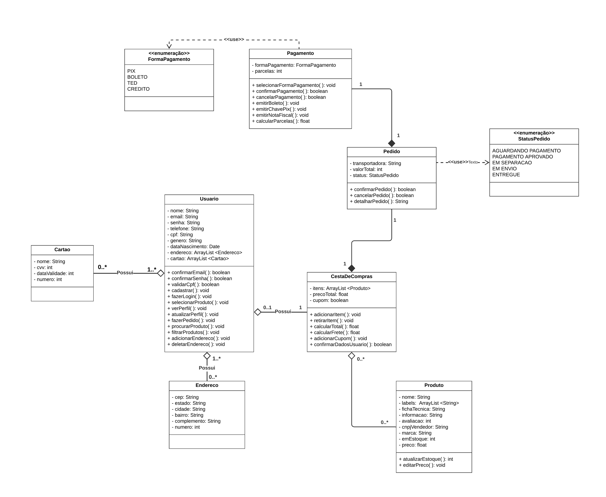
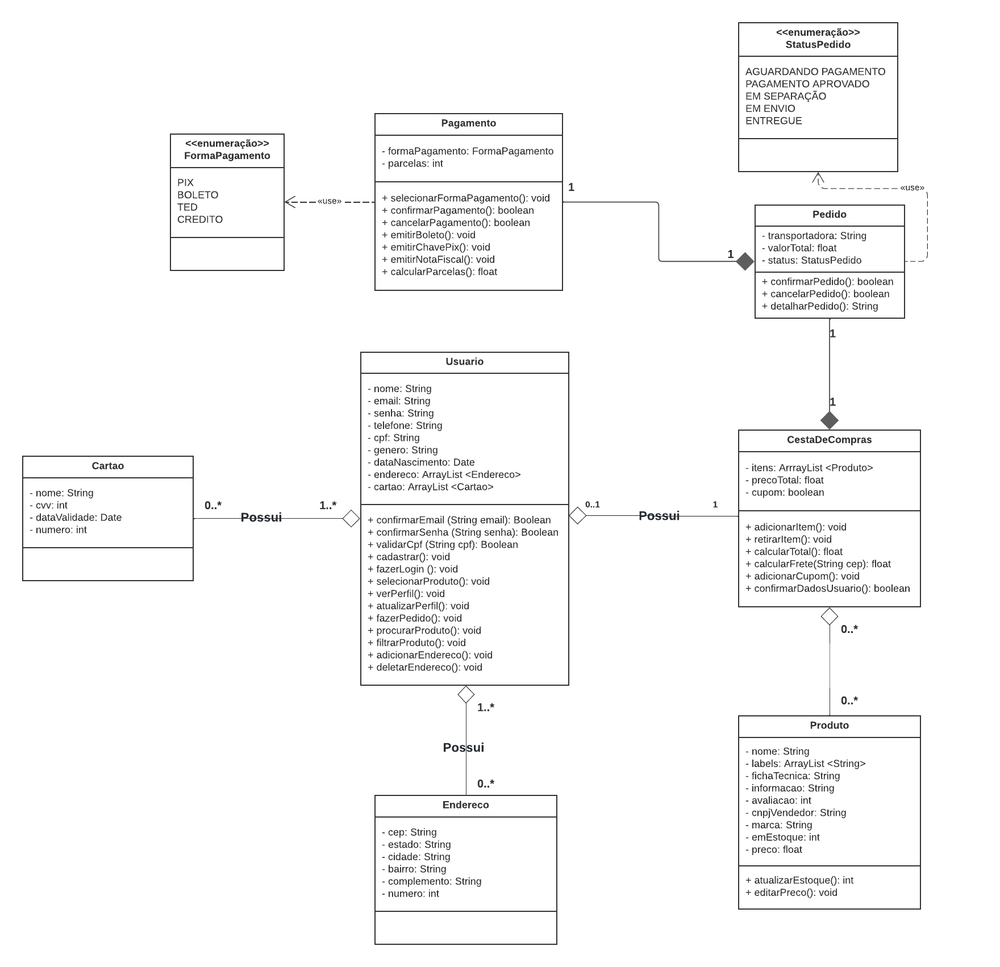
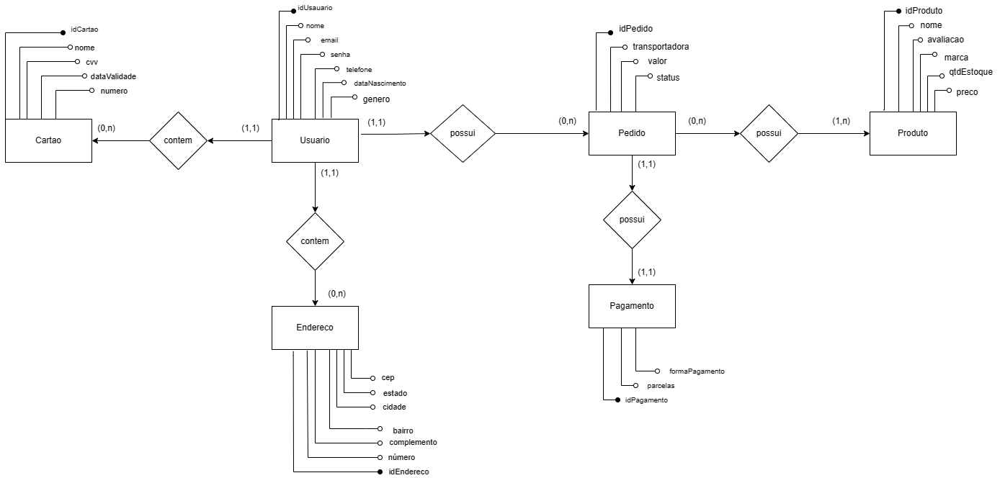
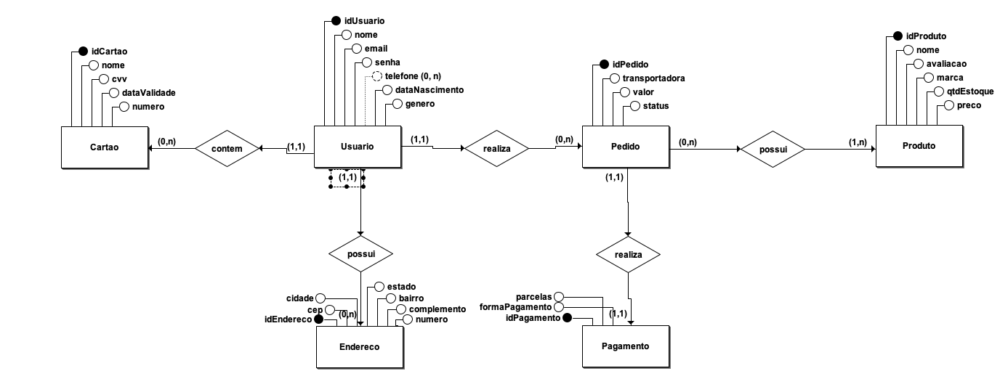
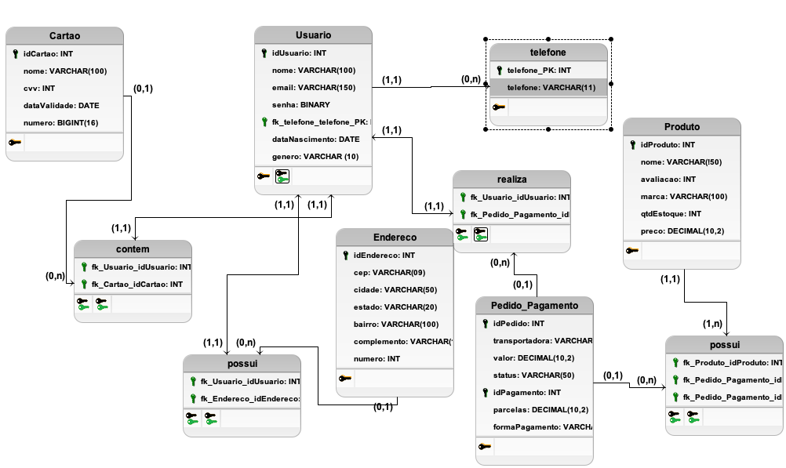
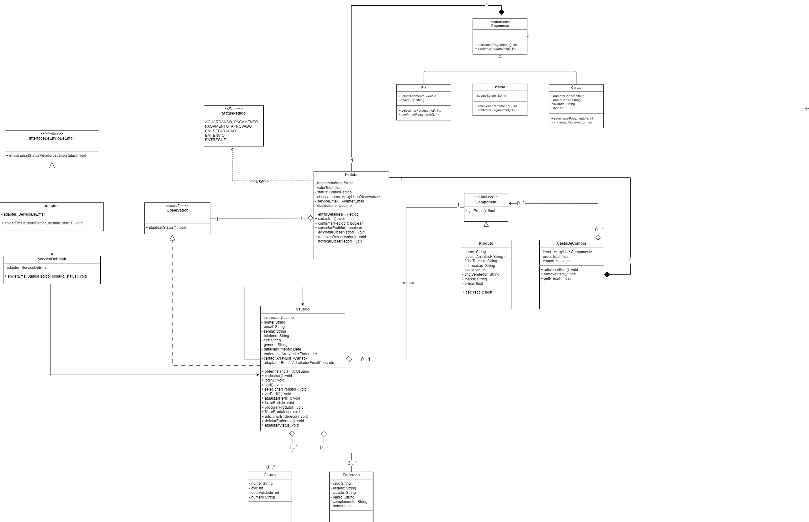
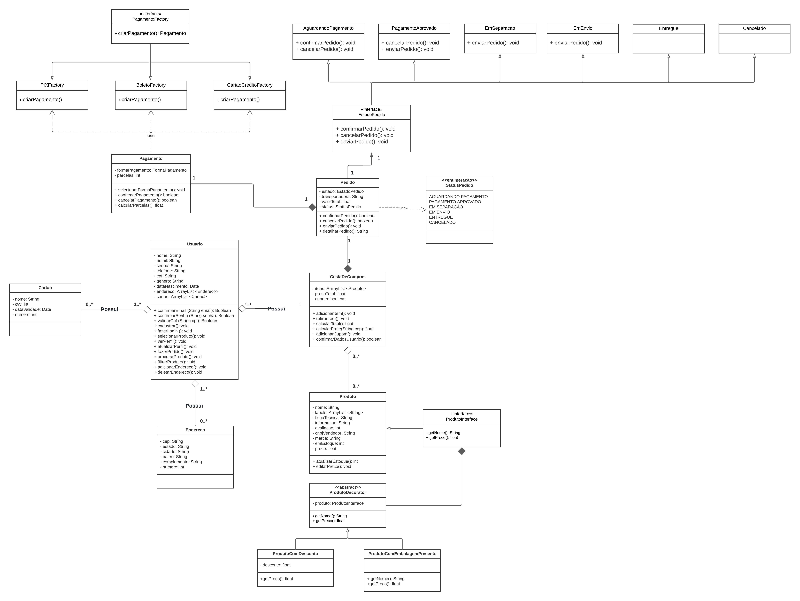

# ***4.1.1. Alterações Realizadas***

## **Introdução**

&emsp;&emsp;O artefato a seguir se trata de um registro para todas as alterações que forem efetuadas em cima do DAS original, que foram registradas no <a href="">DAS alterado</a>.

## **Objetivo**

&emsp;&emsp;Visa listar todas as mudanças que foram realizadas no Documento de Arquitetura de Software original, tais como os seus respectivos rastreamentos, pré/pós alterações e seus motivos.

## **Alteração 1**

&emsp;&emsp;<b>O que foi alterado</b>: Padronização dos títulos de tópicos, corrigindo problemas gramaticais e acrescentando o negrito.

&emsp;&emsp;<b>Onde foi alterado</b>: Por todo o artefato.

&emsp;&emsp;<b>Porque foi alterado</b>: Alguns títulos continham substantivos próprios iniciados com letra minúscula, como também é recomendável inserir o uso de substantivos próprios nos títulos para ajudar a deixar claro a presença de um item ou artefato. Já o negrito é um recurso visual que, ao estar nos títulos dos tópicos, causa melhor distinção e facilita a observação do documento.

## **Alteração 2**

&emsp;&emsp;<b>O que foi alterado</b>: "div align=justify" por "p align=justify" no início de todos os parágrafos, seguindo também a troca de "/div" por "/p" ao final de todos os parágrafos.

&emsp;&emsp;<b>Onde foi alterado</b>: Todo o documento. 

&emsp;&emsp;<b>Porque foi alterado</b>: Melhor formatação entre parágrafos.

## **Alteração 3**

&emsp;&emsp;<b>O que foi alterado</b>: Inserir parágrafos com "&emsp&emsp".

&emsp;&emsp;<b>Onde foi alterado</b>: Tópicos: 4, 4.1, 4.4, 6 e 8. 

&emsp;&emsp;<b>Porque foi alterado</b>: Melhor formatação interna e visualização do artefato, ao utilizar parágrafos.

## **Alteração 4**

&emsp;&emsp;<b>O que foi alterado</b>: Definir palavras-chave nos parágrafos, com o uso de negrito, além de correção de erros gramaticais.

&emsp;&emsp;<b>Onde foi alterado</b>: Tópicos: 1, 1.2, 2.1, 2.2, 2.3, 2.4, 2.5, 3, 4, 4.1, 5.1, 5.2, 6, 7, 7.1, 8, 9 e 10.

&emsp;&emsp;<b>Porque foi alterado</b>: Melhor formatação e visualização do artefato, torna o documento menos monótono e facilita a leitura, por meio de maior coesão do texto.

## **Alteração 5**

&emsp;&emsp;<b>O que foi alterado</b>: Inserção de tópico "Objetivo" no artefato.

&emsp;&emsp;<b>Onde foi alterado</b>: Tópicos: inserido como tópico 1.1.

&emsp;&emsp;<b>Porque foi alterado</b>: Documento tem a necessidade de especificação do seu objetivo.

## **Alteração 6**

&emsp;&emsp;<b>O que foi alterado</b>: Diagrama de Classes.

&emsp;&emsp;<b>Onde foi alterado</b>: Figura 6 do artefato.

&emsp;&emsp;<b>Porque foi alterado</b>: Necessidade de refinamento na sua forma e, principalmente, acréscimo de parâmetros em funções. No geral, as relações foram bem representadas, o foco destas alterações foi otimizar espaço e corrigir pequenos erros, em alguns atributos e funções. Ambas as versões estão disponíveis lado a lado no artefato.

&emsp;&emsp;Antes: 

&emsp;&emsp;Depois: 

&emsp;&emsp;Mudanças realizadas e seus motivos: 
<ul>
<li>Correção de tipo de variável do atributo "dataValidade" da classe "Cartao" de int para date - Atributo que visa representar data estava sendo representado de maneira equivocada;</li>
<li>Inserção de parâmetro "email" do tipo String no método confirmarEmail da classe "Usuario" - Atributo que será utilizado no método para validar o email, logo a sua passagem como parâmetro é fundamental;</li>
<li>Inserção de parâmetro "senha" do tipo String no método confirmarSenha da classe "Usuario" - Atributo que será utilizado no método para validar a senha, logo a sua passagem como parâmetro é fundamental;</li>
<li>Inserção de parâmetro "cpf" do tipo String no método validarCpf da classe "Usuario" - Atributo que será utilizado no método para validar o CPF, logo a sua passagem como parâmetro é fundamental;</li>
<li>Menor horizontalidade no diagrama - Facilitar a visualização.</li>
</ul>

## **Alteração 7**

&emsp;&emsp;<b>O que foi alterado</b>: Diagrama Entidade-Relacionamento.

&emsp;&emsp;<b>Onde foi alterado</b>: Figura 12 do artefato.

&emsp;&emsp;<b>Porque foi alterado</b>: Necessidade de refinamento na sua forma, alguns atributos e relações foram tratados de maneira inadequada. Ambas as versões estão disponíveis lado a lado no artefato.

&emsp;&emsp;Antes: 

&emsp;&emsp;Depois: 

&emsp;&emsp;Mudanças realizadas e seus motivos: 
<ul>
<li>Correção de chave primária da Entidade Usuario de "idUsauario" para "idUsuario" - Erro de digitação;</li>
<li>Mudança de relacionamento entre Entidades Usuario e Endereco de "contem" para "possui" - Evitar redundância;</li>
<li>Mudança de relacionamento entre Entidades Usuario e Pedido de "contem" para "realiza" - Evitar redundância e é mais apropriado;</li>
<li>Mudança de relacionamento entre Entidades Pedido e Pagamento de "possui" para "realiza" - Evitar redundância e é mais apropriado;</li>
<li>Mudança de atributo "telefone" para multivalorado - Pois um usuário pode ter mais de um telefone.</li>
</ul>

## **Alteração 8**

&emsp;&emsp;<b>O que foi alterado</b>: Diagrama Lógico de Dados.

&emsp;&emsp;<b>Onde foi alterado</b>: Figura 13 do artefato.

&emsp;&emsp;<b>Porque foi alterado</b>: Não estava presente no artefato, o uso de um DLD é importante para fornecer a Visão de Dados do sistema, e, por ser uma estrutura de nível lógico, está mais próximo dos dados do que o DER.

## **Alteração 9**

&emsp;&emsp;<b>O que foi alterado</b>: Diagrama de Classes com Padrões de Projeto.

&emsp;&emsp;<b>Onde foi alterado</b>: Figura 9 do artefato.

&emsp;&emsp;<b>Porque foi alterado</b>: Dada a necessidade de inserir novos GoFs para o desenvolvimento do projeto, iniciou-se um estudo de padrões substituíveis e a semântica de tais mudanças para o projeto como um todo.

&emsp;&emsp;Antes: 

&emsp;&emsp;Depois: 

&emsp;&emsp;Mudanças realizadas e seus motivos: 
<ul>
<li>GoF Criacional adicionado: Factory Method, fornece uma interface para criar objetos em uma superclasse, mas permite que as sub-classes alterem os tipos de objetos que serão criados - Com o Factory Method, é possível criar uma fábrica que visa decidir qual método de Pagamento (classe) instanciar com base nessa escolha;</li>
<li>GoF Estrutural adicionado: Decorator, permite o acoplamento de novos comportamentos para objetos ao colocá-los dentro de invólucros de objetos que contêm os comportamentos - O Decorator relacionado ao Produto (classe) proporciona adicionar fatores convenientes em cima do produto, como desconto e queima de estoque, proporcionando melhor manutenabilidade desta classe;</li>
<li>GoF Comportamental adicionado: State - permite que um objeto altere seu comportamento quando seu estado interno muda - O uso do State tira a necessidade de usar enumeradores para gerenciar o estado do Pedido (classe), a hierarquia de classes irá representar cada um desses estados e facilitar o seu tratamento.</li>
</ul>

## **Conclusão**

&emsp;&emsp;Após feitas alterações a nível técnico e estrutural (principalmente) no artefato, conclui-se que o aspecto técnico é de <b>altíssimo nível</b>, com erros - no geral - pontuais e parte das mudanças sendo feitas para viabilizar o desenvolvimento de outras alterações futuras, não necessariamente por falhas que prejudiquem fortemente a qualidade do artefato.

&emsp;&emsp;Já em relação aos aspectos estruturais, observou-se uma <b>ausência de padronização</b> e, em alguns pontos, cuidado com a escrita no artefato, o que é compreensível por se tratar de um documento que recebeu colaboração de diversas pessoas em uma entrega importante e urgente.

&emsp;&emsp;Dito isso, o artefato entregue se encontra refinado em aspectos <b>técnicos</b> e <b>estruturais</b>, com seus parágrafos padronizados e uma leitura mais satisfatória, além de que o seu conteúdo também se incorpou, passando por refatorações que visam aumentar a qualidade e confiabilidade da entrega.

## **Bibliografia**
> <a href="https://unbarqdsw2023-2.github.io/2023.2_G4_ProjetoAmericanas/#/ArquiteturaReutilizacao/4.1.PadroesArquiteturais">[1]</a> Artefato Original.

> <a href="https://unbarqdsw2024-1.github.io/G6-PedroSiqueira_MatheusPerillo-Entrega4/#/ArquiteturaReutilizacao/4.1.PadroesArquiteturais?id=introdu%c3%a7%c3%a3o-e-objetivo">[2]</a> Artefato Modificado.

## **Histórico de Versão**

&emsp;&emsp;A tabela 1 representa o histórico de versão do documento.

<h6 align="center">Tabela 1: Histórico de Versão.</h6>

| Versão | Data      | Descrição                                   | Autor(es) | Revisor(es) |
| ------ | --------- | ------------------------------------------- | --------- | ---------- |
| `1.0`  | 14/08/2024| Criação do Artefato  | [Pedro Siqueira](https://github.com/PedroSiq) | [Matheus Perillo](https://github.com/MatheusPerillo)|
| `1.1`  | 14/08/2024| Atualização títulos de tópicos | [Pedro Siqueira](https://github.com/PedroSiq) | [Matheus Perillo](https://github.com/MatheusPerillo) e [Pedro Siqueira](https://github.com/PedroSiq)|
| `1.2`  | 14/08/2024| Atualização formatação parágrafos  | [Matheus Perillo](https://github.com/MatheusPerillo) e [Pedro Siqueira](https://github.com/PedroSiq) | [Matheus Perillo](https://github.com/MatheusPerillo) e [Pedro Siqueira](https://github.com/PedroSiq)|
| `1.3`  | 15/08/2024| Criando parágrafos | [Matheus Perillo](https://github.com/MatheusPerillo) e [Pedro Siqueira](https://github.com/PedroSiq) | [Matheus Perillo](https://github.com/MatheusPerillo) e [Pedro Siqueira](https://github.com/PedroSiq) |
| `1.4`  | 15/08/2024| Corrigindo erros gramaticais e acrescentando negrito nos textos | [Matheus Perillo](https://github.com/MatheusPerillo) e [Pedro Siqueira](https://github.com/PedroSiq) | [Matheus Perillo](https://github.com/MatheusPerillo) e [Pedro Siqueira](https://github.com/PedroSiq) |
| `1.5`  | 15/08/2024| Acrescentando tópico Objetivo | [Matheus Perillo](https://github.com/MatheusPerillo) e [Pedro Siqueira](https://github.com/PedroSiq) | [Matheus Perillo](https://github.com/MatheusPerillo) e [Pedro Siqueira](https://github.com/PedroSiq) |
| `1.6`  | 16/08/2024| Acrescentando Diagrama de Classes| [Matheus Perillo](https://github.com/MatheusPerillo) e [Pedro Siqueira](https://github.com/PedroSiq) | [Matheus Perillo](https://github.com/MatheusPerillo) e [Pedro Siqueira](https://github.com/PedroSiq) |
| `1.7`  | 16/08/2024| Acrescentando DER | [Matheus Perillo](https://github.com/MatheusPerillo) e [Pedro Siqueira](https://github.com/PedroSiq) | [Matheus Perillo](https://github.com/MatheusPerillo) e [Pedro Siqueira](https://github.com/PedroSiq) |
| `1.8`  | 16/08/2024| Acrescentando DLD | [Matheus Perillo](https://github.com/MatheusPerillo) e [Pedro Siqueira](https://github.com/PedroSiq) | [Matheus Perillo](https://github.com/MatheusPerillo) e [Pedro Siqueira](https://github.com/PedroSiq) |
| `1.9`  | 16/08/2024 | Acrescentando Diagrama de Classes de Padrões Alterado             | [Matheus Perillo](https://github.com/MatheusPerillo) e [Pedro Siqueira](https://github.com/PedroSiq) | [Matheus Perillo](https://github.com/MatheusPerillo) e [Pedro Siqueira](https://github.com/PedroSiq) |

<h6 align="center">Fonte: <a href="https://github.com/PedroSiq">SIQUEIRA, Pedro</a>; <a href="https://github.com/MatheusPerillo">PERILLO, Matheus</a>. 2024.</h6>
