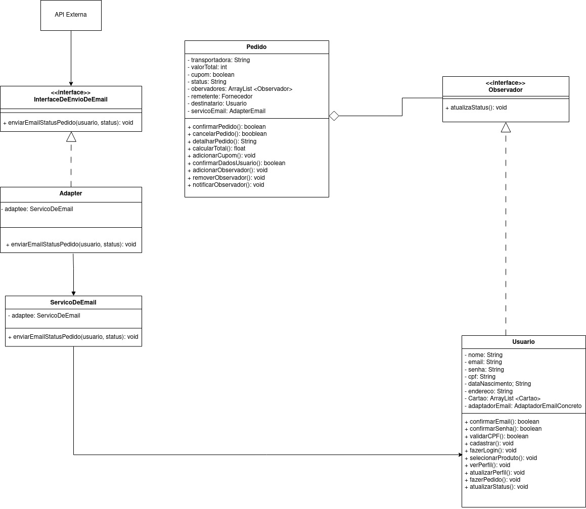
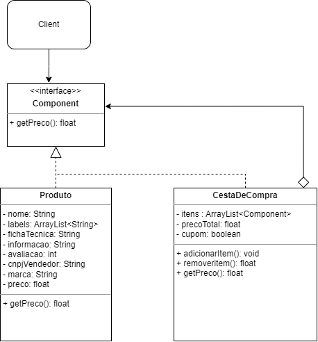
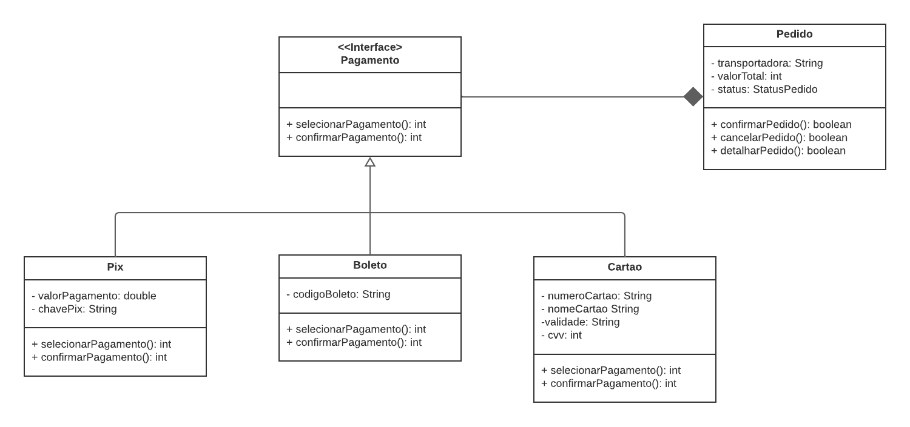
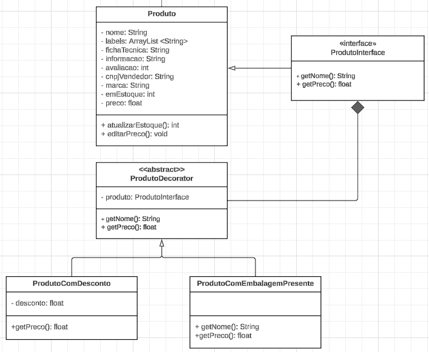
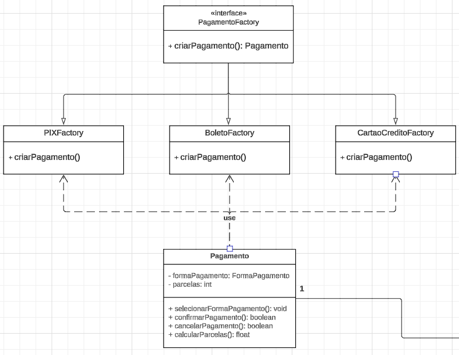
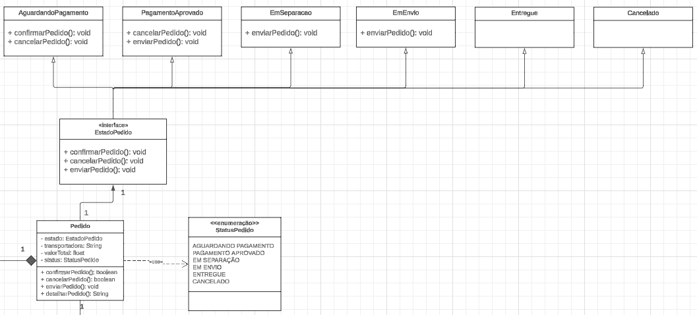
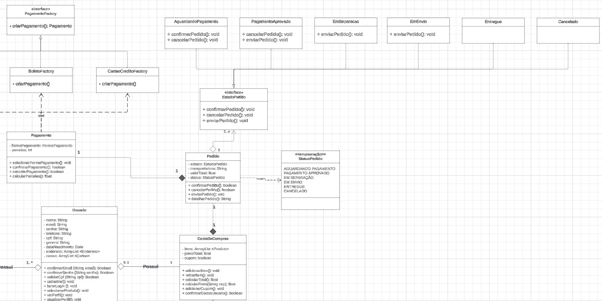

# **_4.1.1. Alterações Realizadas_**

## **Introdução**

&emsp;&emsp;O artefato a seguir se trata de um registro para todas as alterações que forem efetuadas em cima do DAS original, que foram registradas no <a href="">DAS alterado</a>.

## **Objetivo**

&emsp;&emsp;Visa listar todas as mudanças que foram realizadas no Documento de Arquitetura de Software original, tais como os seus respectivos rastreamentos, pré/pós alterações e seus motivos.

## **Alteração 1**

&emsp;&emsp;<b>O que foi alterado</b>: Padronização dos títulos de tópicos, corrigindo problemas gramaticais e acrescentando o negrito.

&emsp;&emsp;<b>Onde foi alterado</b>: Por todo o artefato.

&emsp;&emsp;<b>Porque foi alterado</b>: Alguns títulos continham substantivos próprios iniciados com letra minúscula, como também é recomendável inserir o uso de substantivos próprios nos títulos para ajudar a deixar claro a presença de um item ou artefato. Já o negrito é um recurso visual que, ao estar nos títulos dos tópicos, causa melhor distinção e facilita a observação do documento.

## **Alteração 2**

&emsp;&emsp;<b>O que foi alterado</b>: "div align=justify" por "p align=justify" no início de todos os parágrafos, seguindo também a troca de "/div" por "/p" ao final de todos os parágrafos.

&emsp;&emsp;<b>Onde foi alterado</b>: Todo o documento. 

&emsp;&emsp;<b>Porque foi alterado</b>: Melhor formatação entre parágrafos e melhor visualização.

## **Alteração 3**

&emsp;&emsp;<b>O que foi alterado</b>: Inserir parágrafos com "&emsp&emsp".

&emsp;&emsp;<b>Onde foi alterado</b>: Em todo o artefato.

&emsp;&emsp;<b>Porque foi alterado</b>: Melhor formatação interna e visualização do artefato, ao utilizar parágrafos.

## **Alteração 4**

&emsp;&emsp;<b>O que foi alterado</b>: Definir palavras-chave nos parágrafos, com o uso de negrito, além de correção de erros gramaticais.

&emsp;&emsp;<b>Onde foi alterado</b>: Em todos os tópicos.

&emsp;&emsp;<b>Porque foi alterado</b>: Melhor formatação e visualização do artefato, torna o documento menos monótono e facilita a leitura, por meio de e maior coesão do texto.

## **Alteração 5**

&emsp;&emsp;<b>O que foi alterado</b>: Diagrama de Classes com os padrões de projeto. Foram utilizados os padrões de projeto State, Decorator e Factory Method.

&emsp;&emsp;<b>Onde foi alterado</b>: Nos tópicos 4.1.1, 4.1.2 e 4.1.3.

&emsp;&emsp;<b>Porque foi alterado</b>: Visando refinar o diagrama de classes, acrescentando 3 novos tipos de padrões de projeto que ajudam na performance do projeto. No geral, as relações foram bem representadas, o foco destas alterações foi realmente explorar e utilizar novos padrões que também fizessem sentido e melhorassem a execução do projeto.

&emsp;&emsp;Antes: 

&emsp;&emsp;Depois: 

&emsp;&emsp;Mudanças realizadas e seus motivos: 
<ul>
<li>GoF Criacional adicionado: Factory Method, fornece uma interface para criar objetos em uma superclasse, mas permite que as sub-classes alterem os tipos de objetos que serão criados - Com o Factory Method, é possível criar uma fábrica que visa decidir qual método de Pagamento (classe) instanciar com base nessa escolha;</li>
<li>GoF Estrutural adicionado: Decorator, permite o acoplamento de novos comportamentos para objetos ao colocá-los dentro de invólucros de objetos que contêm os comportamentos - O Decorator relacionado ao Produto (classe) proporciona adicionar fatores convenientes em cima do produto, como desconto e queima de estoque, proporcionando melhor manutenabilidade desta classe;</li>
<li>GoF Comportamental adicionado: State - permite que um objeto altere seu comportamento quando seu estado interno muda - O uso do State tira a necessidade de usar enumeradores para gerenciar o estado do Pedido (classe), a hierarquia de classes irá representar cada um desses estados e facilitar o seu tratamento.</li>
</ul>

## **Alteração 6**

&emsp;&emsp;<b>O que foi alterado</b>: Correção do diagrama de classes com os padrões de projeto.

&emsp;&emsp;<b>Onde foi alterado</b>: Onde o GoF State está modelado, foi corrigido a direção das setas indicando que agora os estados implementam a interface EstadoPedido. Além disso uma agregação de EstadoPedido com a classe Pedido, bem como suas cardinalidades.

&emsp;&emsp;<b>Porque foi alterado</b>: Após correções com a professora foi entendido que era o correto a seguir para melhorar a modelagem do GoF.

&emsp;&emsp;Antes: 

&emsp;&emsp;Depois: 

## **Conclusão**

&emsp;&emsp;Após realizar alterações principalmente no nível técnico e estrutural do artefato, concluiu-se que, do ponto de vista técnico, ele apresenta uma qualidade excepcional, com apenas erros pontuais. Algumas das mudanças realizadas visam facilitar futuras modificações, em vez de corrigir falhas que comprometam significativamente a qualidade do artefato.

&emsp;&emsp;Em termos estruturais, foi identificada uma falta de padronização e, em alguns casos, de cuidado na escrita. Isso é compreensível, dado que o documento contou com a colaboração de várias pessoas em um contexto de entrega importante e urgente.

&emsp;&emsp;Com as melhorias realizadas, o artefato agora apresenta refinamento tanto em aspectos técnicos quanto estruturais, com parágrafos padronizados e uma leitura mais fluida. Além disso, seu conteúdo foi enriquecido e passou por refatorações que visam aumentar a qualidade confiabilidade da entrega e uma exploração melhor do conteúdo exposto em aula.

<h6 align="center">Fonte: <a href="https://github.com/fulanodetal">SOBRENOME, Nome</a>; <a href="https://github.com/fulanodetal">SOBRENOME, Nome</a>. 2024.</h6>

## **Bibliografia**

> <a href="https://unbarqdsw2023-2.github.io/2023.2_G4_ProjetoAmericanas/#/ArquiteturaReutilizacao/4.1.PadroesArquiteturais">[1]</a> Artefato Original.

> <a href="https://Link_da_fonte">[2]</a> Artefato Modificado.

## **Histórico de Versão**

&emsp;&emsp;A tabela 1 representa o histórico de versão do documento.

<h6 align="center">Tabela 1: Histórico de Versão.</h6>

| Versão | Data       | Descrição             | Autor(es)                                            | Revisor(es)                                   |
| ------ | ---------- | --------------------- | ---------------------------------------------------- | --------------------------------------------- |
| `1.0`  | 15/08/2024 | Criação do artefato   | [Matheus Perillo](https://github.com/MatheusPerillo) | [Pedro Siqueira](https://github.com/PedroSiq) |
| `1.1`  | 16/08/2024 | Adição das alterações | [Matheus Perillo](https://github.com/MatheusPerillo) | [Pedro Siqueira](https://github.com/PedroSiq) |
| `1.2`  | 16/08/2024 | Adição de correções   | [Matheus Perillo](https://github.com/MatheusPerillo) | [Pedro Siqueira](https://github.com/PedroSiq) |

<h6 align="center">Fonte: <a href="https://github.com/PedroSiq">SIQUEIRA, Pedro</a>; <a href="https://github.com/MatheusPerillo">PERILLO, Matheus</a>. 2024.</h6>
