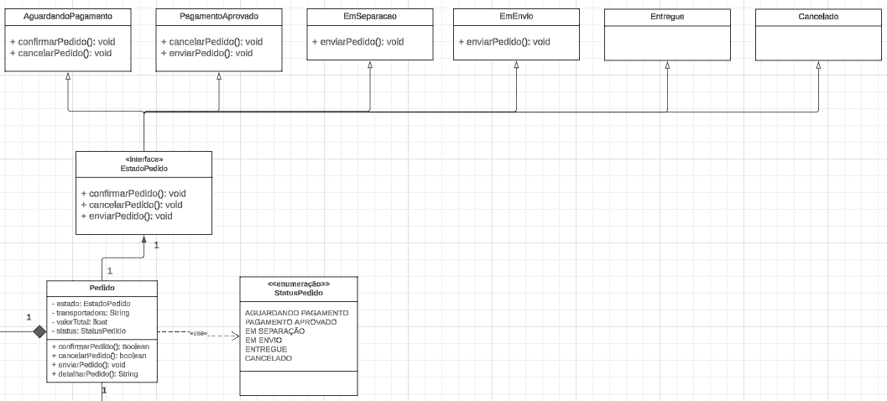
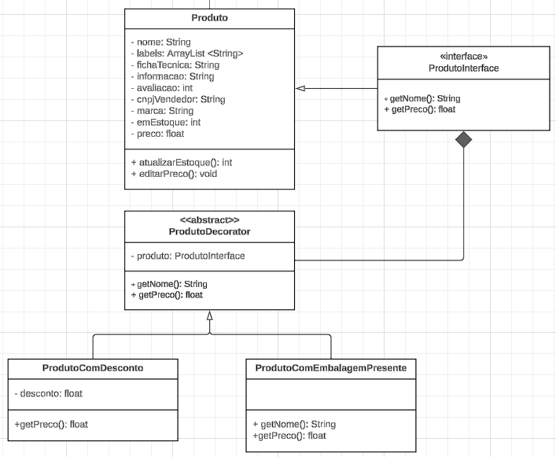

# **_4.2. Módulo Reutilização de Software_**

## **Introdução e Objetivo**

<p align="justify">
&emsp;&emsp;O presente artefato se trata de uma versão refinada, sob olhar externo, do design arquitetural focado em reuso de código criado pelo <a href="https://unbarqdsw2023-2.github.io/2023.2_G4_ProjetoAmericanas/#/ArquiteturaReutilizacao/4.1.PadroesArquiteturais">Grupo 04 de 2023.2 (Americanas)</a>.
</p>
<p align="justify">
&emsp;&emsp;O objetivo é refinar aspectos técnicos e estruturais do artefato, de modo à trazer uma versão aprimorada por uma visão externa ao desenvolvimento do projeto.
</p>

## 1. Introdução

<p align="justify">
&emsp;&emsp;Na maioria dos projetos de software, há algum reuso de software. Isso acontece muitas vezes informalmente, quando as pessoas envolvidas no projeto sabem de projetos ou códigos semelhantes ao que é exigido. Elas os buscam, fazem as modificações necessárias e as incorporam em seus sistemas. Apesar de o reuso ter sido proposto como uma estratégia de desenvolvimento há mais de 40 anos (McILROY, 1968), só em 2000 o ‘desenvolvimento com reuso’ se tornou a norma para novos sistemas de negócios.

&emsp;&emsp;A mudança para o desenvolvimento baseado em reuso foi uma resposta às
exigências de menores custos de produção e manutenção de software, entregas mais rápidas de sistemas e softwares de
maior qualidade. Cada vez mais empresas consideram o software como um ativo valioso. O reuso tem sido promovido
para aumentar o retorno sobre os investimentos em software. (Sommerville, Ian. 2011) Exemplos de unidade de software reutilizáveis:

</p>

<p align="justify">

1. **Reuso de sistema de aplicação:** A totalidade de um sistema de aplicação pode ser reusada sem alterações em outros
   sistemas ou pela configuração da aplicação para diferentes clientes. Como alternativa, podem ser desenvolvidas famílias de aplicações com uma arquitetura comum, mas adaptadas para clientes específicos.
2. **Reuso de componentes:** Os componentes de uma aplicação, variando em tamanho desde subsistemas até objetos
   únicos, podem ser reusados. Por exemplo, um sistema de identificação de padrões desenvolvido como parte de
   um sistema de processamento de textos pode ser reusado em um sistema de gerenciamento de banco de dados.
3. **Reuso de objetos e funções:** Componentes de software que implementam uma única função, como uma função
matemática ou uma classe de objeto, podem ser reusados. Essa forma de reuso, baseada em bibliotecas-padrão,
tem sido comum nos últimos 40 anos. Muitas bibliotecas de funções e classes estão disponíveis gratuitamente.
Você reusa as classes e funções nessas bibliotecas, ligando-as com o código da aplicação recém-desenvolvido. Essa
é uma abordagem particularmente eficaz em áreas como algoritmos e gráficos matemáticos, em que o conheci-
mento especializado é necessário para o desenvolvimento de funções e objetos eficientes.
</p>

## 2. Objetivo

<p align="justify">
&emsp;&emsp; O objetivo do artefato em questão é propor um design arquitetural focado em reuso de código e componentes para a aplicação das Lojas Americanas, levando em consideração conceitos e tecnologias que podem ser utilizadas para tal. 
</p>

## 3. Metodologia

<p align="justify">
&emsp;&emsp; As propostas de projeto, design e tecnologias sustentadas nesse artefato foram discutidas e pensadas em grupo e visando entender melhor e aplicar os aos conceitos apresentados nas aulas de arquitetura e reuso de software.
</p>

## 4. Desenvolvimento

### 4.1 Reuso de Conceito

<p align="jutify">
&emsp;&emsp; Os componentes e os sistemas de software são entidades potencialmente reusáveis, mas, algumas vezes, sua natureza
específica significa que é caro modificá-los para uma nova situação. Uma forma complementar de reuso é o ‘reuso
de conceito’, em que, em vez de reusar um componente de software, você reusa uma ideia, uma forma, um trabalho ou
um algoritmo. Pode, portanto, ser configurado e adaptado para uma série de situações. O conceito de reuso pode ser incorporado em abordagens como <b>padrões de projeto</b>, que é a forma que reuso que foi desendolvida nessa seção.(Sommerville, Ian. 2011)
</p>

#### 4.1.1 Pedido - State

<p align="jutify">
&emsp;&emsp; Com base nos pontos apresentados abaixo, escolhemos o padrão State, onde você tem a necessidade de notificar Usuario sobre mudanças no status de Pedido.

&emsp;&emsp;O State permite que um objeto altere seu comportamento quando seu estado interno muda - O uso do State tira a necessidade de usar enumeradores para gerenciar o estado do Pedido (classe), a hierarquia de classes irá representar cada um desses estados e facilitar o seu tratamento.

</p>

**Exemplo de Modelagem da classe Pedido com o State:**



<p align="center">
Figura 1 - Padrão de projeto State modelado.<br>Autor: Matheus Perillo e Pedro Siqueira.
</p>


<p align="center">
Figura 2 - Padrão de projeto State modelado versão 2.<br>Autor: Matheus Perillo e Pedro Siqueira.
</p>

**Exemplo de implementação da classe Pedido como um State em Java:**

```java
public interface EstadoPedido {
    void confirmarPedido(Pedido pedido);
    void cancelarPedido(Pedido pedido);
    void enviarPedido(Pedido pedido);
}

```

```java
public class AguardandoPagamento implements EstadoPedido {
    @Override
    public void confirmarPedido(Pedido pedido) {
        pedido.setEstado(new PagamentoAprovado());
        System.out.println("Pedido confirmado, aguardando pagamento.");
    }

    @Override
    public void cancelarPedido(Pedido pedido) {
        pedido.setEstado(new Cancelado());
        System.out.println("Pedido cancelado.");
    }

    @Override
    public void enviarPedido(Pedido pedido) {
        System.out.println("Pedido não pode ser enviado, pagamento ainda não aprovado.");
    }
}

public class PagamentoAprovado implements EstadoPedido {
    @Override
    public void confirmarPedido(Pedido pedido) {
        System.out.println("Pedido já confirmado.");
    }

    @Override
    public void cancelarPedido(Pedido pedido) {
        pedido.setEstado(new Cancelado());
        System.out.println("Pedido cancelado após pagamento aprovado.");
    }

    @Override
    public void enviarPedido(Pedido pedido) {
        pedido.setEstado(new EmSeparacao());
        System.out.println("Pedido em separação.");
    }
}

public class EmSeparacao implements EstadoPedido {
    @Override
    public void confirmarPedido(Pedido pedido) {
        System.out.println("Pedido já está em separação.");
    }

    @Override
    public void cancelarPedido(Pedido pedido) {
        pedido.setEstado(new Cancelado());
        System.out.println("Pedido cancelado durante a separação.");
    }

    @Override
    public void enviarPedido(Pedido pedido) {
        pedido.setEstado(new EmEnvio());
        System.out.println("Pedido em envio.");
    }
}

public class EmEnvio implements EstadoPedido {
    @Override
    public void confirmarPedido(Pedido pedido) {
        System.out.println("Pedido já está em envio.");
    }

    @Override
    public void cancelarPedido(Pedido pedido) {
        System.out.println("Pedido não pode ser cancelado, já está em envio.");
    }

    @Override
    public void enviarPedido(Pedido pedido) {
        pedido.setEstado(new Entregue());
        System.out.println("Pedido entregue.");
    }
}

public class Entregue implements EstadoPedido {
    @Override
    public void confirmarPedido(Pedido pedido) {
        System.out.println("Pedido já foi entregue.");
    }

    @Override
    public void cancelarPedido(Pedido pedido) {
        System.out.println("Pedido não pode ser cancelado, já foi entregue.");
    }

    @Override
    public void enviarPedido(Pedido pedido) {
        System.out.println("Pedido já foi entregue.");
    }
}

public class Cancelado implements EstadoPedido {
    @Override
    public void confirmarPedido(Pedido pedido) {
        System.out.println("Pedido foi cancelado, não pode ser confirmado.");
    }

    @Override
    public void cancelarPedido(Pedido pedido) {
        System.out.println("Pedido já foi cancelado.");
    }

    @Override
    public void enviarPedido(Pedido pedido) {
        System.out.println("Pedido foi cancelado, não pode ser enviado.");
    }
}

```

```java
public class Pedido {
    private EstadoPedido estado;
    private String transportadora;
    private float valorTotal;
    private StatusPedido status;

    public Pedido() {
        this.estado = new AguardandoPagamento();
        this.status = StatusPedido.AGUARDANDO_PAGAMENTO;
    }

    public void setEstado(EstadoPedido estado) {
        this.estado = estado;
    }

    public void setStatus(StatusPedido status) {
        this.status = status;
    }

    public void confirmarPedido() {
        estado.confirmarPedido(this);
    }

    public void cancelarPedido() {
        estado.cancelarPedido(this);
    }

    public void enviarPedido() {
        estado.enviarPedido(this);
    }

    public void detalharPedido() {
        System.out.println("Pedido com status: " + status);
        System.out.println("Valor total: " + valorTotal);
        System.out.println("Transportadora: " + transportadora);
    }
}

```

```java
public enum StatusPedido {
    AGUARDANDO_PAGAMENTO,
    PAGAMENTO_APROVADO,
    EM_SEPARACAO,
    EM_ENVIO,
    ENTREGUE,
    CANCELADO
}

```

#### 4.1.2 Pagamento - Factory Method

<p align="justify">
&emsp;&emsp;Durante o curso, exploramos conceitos de padrões de projeto. Após essa etapa, ao analisar nosso projeto, identificamos a oportunidade de implementar o padrão de projeto Factory Method. Essa decisão visa aprimorar o projeto, especialmente no que diz respeito às funcionalidades de pagamento dos produtos das Lojas Americanas.</p>

&emsp;&emsp;O Factory Method, fornece uma interface para criar objetos em uma superclasse, mas permite que as sub-classes alterem os tipos de objetos que serão criados - Com o Factory Method, é possível criar uma fábrica que visa decidir qual método de Pagamento (classe) instanciar com base nessa escolha;

**Exemplo de Modelagem da classe Pagamento usando Factory Method:**


<p align="center">
Figura 3 - Padrão de projeto Factory Method modelado.<br>Autor: Matheus Perillo e Pedro Siqueira.
</p>


<p align="center">
Figura 4 - Padrão de projeto Factory Method modelado versão 2.<br>Autor: Matheus Perillo e Pedro Siqueira.
</p>

**Exemplo de implementação da classe Pagamento com Factory Method em Java:**

```java
public interface PagamentoFactory {
    Pagamento criarPagamento();
}
```

```java
public abstract class Pagamento {
    protected String formaPagamento;
    protected int parcelas;

    public Pagamento(String formaPagamento, int parcelas) {
        this.formaPagamento = formaPagamento;
        this.parcelas = parcelas;
    }

    public abstract boolean confirmarPagamento();
    public abstract boolean cancelarPagamento();
    public abstract float calcularParcelas();
}
```

```java
public class PIXFactory implements PagamentoFactory {

    @Override
    public Pagamento criarPagamento() {
        return new PagamentoPIX("PIX", 1);
    }
}

```

```java
public class BoletoFactory implements PagamentoFactory {

    @Override
    public Pagamento criarPagamento() {
        return new PagamentoBoleto("BOLETO", 1);
    }
}

```

```java
public class CartaoCreditoFactory implements PagamentoFactory {

    @Override
    public Pagamento criarPagamento() {
        return new PagamentoCartaoCredito("CREDITO", 12);
    }
}

```

```java
public class PagamentoPIX extends Pagamento {

    public PagamentoPIX(String formaPagamento, int parcelas) {
        super(formaPagamento, parcelas);
    }

    @Override
    public boolean confirmarPagamento() {
        System.out.println("Pagamento confirmado via PIX.");
        return true;
    }

    @Override
    public boolean cancelarPagamento() {
        System.out.println("Pagamento via PIX cancelado.");
        return true;
    }

    @Override
    public float calcularParcelas() {
        return 0;
    }
}

```

```java
public class PagamentoBoleto extends Pagamento {

    public PagamentoBoleto(String formaPagamento, int parcelas) {
        super(formaPagamento, parcelas);
    }

    @Override
    public boolean confirmarPagamento() {
        System.out.println("Pagamento confirmado via Boleto.");
        return true;
    }

    @Override
    public boolean cancelarPagamento() {
        System.out.println("Pagamento via Boleto cancelado.");
        return true;
    }

    @Override
    public float calcularParcelas() {
        return 0;
    }
}

```

```java
public class PagamentoCartaoCredito extends Pagamento {

    public PagamentoCartaoCredito(String formaPagamento, int parcelas) {
        super(formaPagamento, parcelas);
    }

    @Override
    public boolean confirmarPagamento() {
        System.out.println("Pagamento confirmado via Cartão de Crédito.");
        return true;
    }

    @Override
    public boolean cancelarPagamento() {
        System.out.println("Pagamento via Cartão de Crédito cancelado.");
        return true;
    }


}

```

#### 4.1.3 Produto - Decorator

<p align="jutify">
&emsp;&emsp; O padrão de projeto Decorator permite que você acople novos comportamentos para objetos ao colocá-los dentro de invólucros de objetos que contém os comportamentos. Neste projeto podemos lidar com o uso de funcionalidades adicionais ou incrementais em classes que precisam ser flexíveis e extensíveis.

&emsp;&emsp;Este padrão de projeto relacionado ao Produto (classe) proporciona adicionar fatores convenientes em cima do produto, como desconto e queima de estoque, proporcionando melhor manutenabilidade desta classe;

</p>

**Exemplo de Modelagem da classe Produto com Decorator:**



<p align="center">
Figura 5 - Padrão de projeto Decorator modelado.<br>Autor: Matheus Perillo e Pedro Siqueira.
</p> <br>

**Exemplo de implementação da classe Produto como um Decorator em Java:**

```java
public interface ProdutoInterface {
    String getNome();
    float getPreco();
}

```

```java
import java.util.ArrayList;

public class Produto implements ProdutoInterface {
    private String nome;
    private ArrayList<String> labels;
    private String fichaTecnica;
    private String informacao;
    private int avaliacao;
    private String cnpjVendedor;
    private String marca;
    private int emEstoque;
    private float preco;

    public Produto(String nome, float preco) {
        this.nome = nome;
        this.preco = preco;
        this.labels = new ArrayList<>();
    }

    @Override
    public String getNome() {
        return nome;
    }

    @Override
    public float getPreco() {
        return preco;
    }

    public int atualizarEstoque(int quantidade) {
        this.emEstoque += quantidade;
        return emEstoque;
    }

    public void editarPreco(float novoPreco) {
        this.preco = novoPreco;
    }
}

```

```java
public abstract class ProdutoDecorator implements ProdutoInterface {
    protected ProdutoInterface produto;

    public ProdutoDecorator(ProdutoInterface produto) {
        this.produto = produto;
    }

    @Override
    public String getNome() {
        return produto.getNome();
    }

    @Override
    public float getPreco() {
        return produto.getPreco();
    }
}

```

```java
public class ProdutoComDesconto extends ProdutoDecorator {
    private float desconto;

    public ProdutoComDesconto(ProdutoInterface produto, float desconto) {
        super(produto);
        this.desconto = desconto;
    }

    @Override
    public float getPreco() {
        return produto.getPreco() - desconto;
    }
}

```

```java
public class ProdutoComEmbalagemPresente extends ProdutoDecorator {

    public ProdutoComEmbalagemPresente(ProdutoInterface produto) {
        super(produto);
    }

    @Override
    public String getNome() {
        return produto.getNome() + " com embalagem para presente";
    }

    @Override
    public float getPreco() {
        return produto.getPreco() + 10.0f;
    }
}

```

### 4.2 Reuso Externo

<p align="jutify">
&emsp;&emsp;Muitas técnicas e ferramentas foram desenvolvidas para oferecer suporte a implementações centradas no reuso de software. Essas abordagens concentram-se em aplicações que compartilham sistemas ou domínios de aplicação, buscando semelhanças e potencial de reuso. O conceito de reuso é amplo, e, no contexto do software, pode se manifestar em implementações desde funções simples, que encapsulam códigos usados em várias partes de uma aplicação, até fluxos complexos com utilidade em poucos locais, mas que necessitam manter consistência em seu funcionamento, justificando assim sua associação.
</p>

### 4.3 Frameworks

<p align="jutify">
&emsp;&emsp;Frameworks podem ser descritos como software para desenvolvimento de softwares. Um software que melhor suporta um processo de desenvolvimento orientado a objetos por meio das abstrações de alta granularidade, simplificando, um conjunto de classes, objetos e componentes que nós oferecem ferramentas que auxiliam no desenvolvimento de software.
</p>

<p align="jutify">
&emsp;&emsp;Existem vários tipos de frameworks, cada um deles focado em algum ponto no desenvolvimento de software.No quesito reuso de projeto, frameworks podem auxiliar na reutilização de classes no sistema, podendo ser utilizado herança, classes abstratas entre outras ferramentas de implementação.
</p>

#### 4.3.1 ReactJs

<p align="jutify">
&emsp;&emsp;O React.js é tecnicamente uma biblioteca, mas para muitos, é considerado um framework para o desenvolvimento web com JavaScript. O React.js oferece uma ampla gama de ferramentas que tornam o desenvolvimento e a reutilização de código mais acessíveis. Em vez de nos concentrarmos em um framework específico, vamos explorar algumas das opções que esta biblioteca nos oferece para criar códigos front-end de forma fácil e reutilizável.

&emsp;&emsp;Todo o desenvolvimento de componentes, que são a base do React.js, nos permite criar códigos de menor escala para serem utilizados em várias páginas diferentes. Um bom exemplo disso pode ser observado na criação de formulários, onde cada formulário possui campos para inserção de valores e um botão para enviar essas informações.

</p>

<div align="center">

</div>
<p align="center">
Figura 1 - Componente de input<br>Autor: autoria propia
</p> <br>

<p align="jutify">
&emsp;&emsp;O componente de input é utilizado múltiplas vezes nesse formulário e poderia ser aproveitado em componentes ou páginas sem relação direta com formulários. Este é apenas um pequeno exemplo das possibilidades de reutilização oferecidas pelos componentes no React.js 
</p> <br>

<div align="center">

</div>
<p align="center">
Figura 2 - Componente de formulario<br>Autor: autoria propria
</p> <br>

### 4.4 Ferramentas

#### 4.4.1 Vite

<p align="jutify">
&emsp;&emsp;O Vite é um sistema de construção (build system) e um servidor de desenvolvimento para aplicativos da web modernos. Ele utiliza a especificação de módulos ECMAScript, que introduz a capacidade de organizar o código em módulos, permitindo uma melhor modularização e reutilização de código em aplicações JavaScript. Isso se integra muito bem com frameworks como Vue.js ou React, onde componentes podem ser modularizados e reutilizados em diferentes partes do aplicativo.
</p>

<br>
<div align="center">

</div>
<p align="center">
Figura 3 - Criação de projeto com Vite<br>Autor: autoria propria
</p> <br>

#### 4.4.2 Docker

<p align="jutify">
&emsp;&emsp;Ao utilizar um Dockerfile, você pode encapsular todas as dependências do seu software em uma imagem, tornando-o independente do ambiente de execução. Isso é crucial para a reutilização externa, pois qualquer pessoa pode baixar sua imagem e executar o software em seu ambiente sem se preocupar com conflitos de dependências.
</p>

<br>
<div align="center">

</div>
<p align="center">
Figura 4 - Arquivo Dockerfile<br>Autor: autoria propria
</p> <br>

<p align="jutify">
&emsp;&emsp;O docker-compose é uma ferramenta que simplifica o processo de orquestração de múltiplos containers. Com um único arquivo YAML, você pode definir vários serviços, redes e volumes necessários para a execução do seu aplicativo. Isso facilita a distribuição do seu software juntamente com todas as suas dependências, proporcionando uma experiência consistente, independentemente do ambiente em que está sendo executado.
</p>

<br>
<div align="center">

</div>
<p align="center">
Figura 5 - Arquivo docker-compose.yml<br>Autor: autoria propria
</p> <br>

## 5. Resultado e conclusões

<p align="jutify">
&emsp;&emsp;Discorrer e analisar as conclusões do artefato. A depender, trocar o nome desse tópico para apenas "Conclusão".
</p>

## 6. Referências

> - Sommerville, Ian. Engenharia de Software / Ian Sommerville ; tradução Ivan Bosnic e Kalinka G. de O. Gonçalves ; revisão técnica Kechi Hirama. — 9. ed. — São Paulo : Pearson Prentice Hall, 2011.
> - Refactoring Guru. (s.d.). Chain of Responsibility. Disponível em: https://refactoring.guru/design-patterns/chain-of-responsibility. Acesso em: 30 de novembro de 2023.
> - React. Keeping Components Pure. React, 2023. Disponível em: https://react.dev/learn/keeping-components-pure. Acesso em: 30 Nov. 2023.
> - Vite. (s.d.). JavaScript Bundler and Development Server. Disponível em: https://vitejs.dev/. Acesso em: 30 de novembro de 2023.
> - de O. Gonçalves ; revisão técnica Kechi Hirama. — 9. ed. — São Paulo : Pearson
> - Prentice Hall, 2011.

## 7. **Histórico de Versão**

<p align="justify">
&emsp;&emsp;A tabela 1 representa o histórico de versão do documento.
</p>

<h6 align="center">Tabela 1: Histórico de Versão.</h6>
<div align="center">

| Versão | Data       | Descrição                                                    | Autor(es)                                            | Revisor(es)                                   |
| ------ | ---------- | ------------------------------------------------------------ | ---------------------------------------------------- | --------------------------------------------- |
| `1.0`  | 15/08/2024 | Criação do artefato                                          | [Matheus Perillo](https://github.com/MatheusPerillo) | [Pedro Siqueira](https://github.com/PedroSiq) |
| `1.1`  | 15/08/2024 | Padronização e correção da estrutura e gramática do artefato | [Matheus Perillo](https://github.com/MatheusPerillo) | [Pedro Siqueira](https://github.com/PedroSiq) |
| `1.2`  | 16/08/2024 | Adição dos UMLs e suas implementações                        | [Matheus Perillo](https://github.com/MatheusPerillo) | [Pedro Siqueira](https://github.com/PedroSiq) |
| `1.3`  | 16/08/2024 | Explicação dos GoFs                                          | [Matheus Perillo](https://github.com/MatheusPerillo) | [Pedro Siqueira](https://github.com/PedroSiq) |
| `1.4`  | 16/08/2024 | Correções do diagrama                                        | [Matheus Perillo](https://github.com/MatheusPerillo) | [Pedro Siqueira](https://github.com/PedroSiq) |

</div>
<h6 align="center">Fonte: <a href="https://github.com/PedroSiq">SIQUEIRA, Pedro</a>; <a href="https://github.com/MatheusPerillo">PERILLO, Matheus</a>. 2024.</h6>
