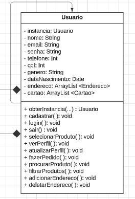

# **_4.2. Módulo Reutilização de Software_**

## **Introdução e Objetivo**

<p align="justify">
&emsp;&emsp;O presente artefato se trata de uma versão refinada, sob olhar externo, do design arquitetural focado em reuso de código criado pelo <a href="https://unbarqdsw2023-2.github.io/2023.2_G4_ProjetoAmericanas/#/ArquiteturaReutilizacao/4.1.PadroesArquiteturais">Grupo 04 de 2023.2 (Americanas)</a>.
</p>
<p align="justify">
&emsp;&emsp;O objetivo é refinar aspectos técnicos e estruturais do artefato, de modo à trazer uma versão aprimorada por uma visão externa ao desenvolvimento do projeto.
</p>

## 1. Introdução

<p align="justify">
&emsp;&emsp;Na maioria dos projetos de software, há algum reuso de software. Isso acontece muitas vezes informalmente, quando as pessoas envolvidas no projeto sabem de projetos ou códigos semelhantes ao que é exigido. Elas os buscam, fazem as modificações necessárias e as incorporam em seus sistemas. Apesar de o reuso ter sido proposto como uma estratégia de desenvolvimento há mais de 40 anos (McILROY, 1968), só em 2000 o ‘desenvolvimento com reuso’ se tornou a norma para novos sistemas de negócios.

&emsp;&emsp;A mudança para o desenvolvimento baseado em reuso foi uma resposta às
exigências de menores custos de produção e manutenção de software, entregas mais rápidas de sistemas e softwares de
maior qualidade. Cada vez mais empresas consideram o software como um ativo valioso. O reuso tem sido promovido
para aumentar o retorno sobre os investimentos em software. (Sommerville, Ian. 2011) Exemplos de unidade de software reutilizáveis:

</p>

<p align="justify">

1. **Reuso de sistema de aplicação:** A totalidade de um sistema de aplicação pode ser reusada sem alterações em outros
   sistemas ou pela configuração da aplicação para diferentes clientes. Como alternativa, podem ser desenvolvidas famílias de aplicações com uma arquitetura comum, mas adaptadas para clientes específicos.
2. **Reuso de componentes:** Os componentes de uma aplicação, variando em tamanho desde subsistemas até objetos
   únicos, podem ser reusados. Por exemplo, um sistema de identificação de padrões desenvolvido como parte de
   um sistema de processamento de textos pode ser reusado em um sistema de gerenciamento de banco de dados.
3. **Reuso de objetos e funções:** Componentes de software que implementam uma única função, como uma função
matemática ou uma classe de objeto, podem ser reusados. Essa forma de reuso, baseada em bibliotecas-padrão,
tem sido comum nos últimos 40 anos. Muitas bibliotecas de funções e classes estão disponíveis gratuitamente.
Você reusa as classes e funções nessas bibliotecas, ligando-as com o código da aplicação recém-desenvolvido. Essa
é uma abordagem particularmente eficaz em áreas como algoritmos e gráficos matemáticos, em que o conheci-
mento especializado é necessário para o desenvolvimento de funções e objetos eficientes.
</p>

## 2. Objetivo

<p align="justify">
&emsp;&emsp; O objetivo do artefato em questão é propor um design arquitetural focado em reuso de código e componentes para a aplicação das Lojas Americanas, levando em consideração conceitos e tecnologias que podem ser utilizadas para tal. 
</p>

## 3. Metodologia

<p align="justify">
&emsp;&emsp; As propostas de projeto, design e tecnologias sustentadas nesse artefato foram discutidas e pensadas em grupo e visando entender melhor e aplicar os aos conceitos apresentados nas aulas de arquitetura e reuso de software.
</p>

## 4. Desenvolvimento

### 4.1 Reuso de Conceito

<p align="jutify">
&emsp;&emsp; Os componentes e os sistemas de software são entidades potencialmente reusáveis, mas, algumas vezes, sua natureza
específica significa que é caro modificá-los para uma nova situação. Uma forma complementar de reuso é o ‘reuso
de conceito’, em que, em vez de reusar um componente de software, você reusa uma ideia, uma forma, um trabalho ou
um algoritmo. Pode, portanto, ser configurado e adaptado para uma série de situações. O conceito de reuso pode ser incorporado em abordagens como <b>padrões de projeto</b>, que é a forma que reuso que foi desendolvida nessa seção.(Sommerville, Ian. 2011)
</p>

#### 4.1.1 Pedido - Observer/Adapter

<p align="jutify">
&emsp;&emsp; Com base nos pontos apresentados abaixo, escolhemos o padrão Observer, onde você tem a necessidade de notificar Usuario sobre mudanças no status de Pedido e mantém baixo o acoplamento entre essas duas classes.

1. **Desacoplamento:**
   O padrão Observer é projetado para fornecer um mecanismo de notificação onde objetos (observadores) podem ser informados sobre mudanças em outro objeto (sujeito) sem a necessidade de acoplamento direto entre eles.
   Isso é particularmente útil quando você quer garantir que várias partes do sistema possam reagir a mudanças sem conhecerem explicitamente umas às outras.

2. **Implementação Flexível:**
   O padrão Observer permite uma implementação flexível, onde você pode ter vários observadores interessados nas mudanças de um sujeito. No seu caso, vários Usuario podem estar interessados nas atualizações do Pedido.

3. **Reusabilidade:**
   O padrão Observer promove a reusabilidade ao permitir que novos observadores sejam adicionados facilmente sem modificar o sujeito.

&emsp;&emsp; Além disso, imaginamos que seria necessário o uso de uma API externa para notificar o usuário através do email, e implementamos um padrão adapter para disponibilizar esse serviço e manter acoplamento baixo aos objetos do nosso sistema.

</p>

##### Implementação

<div align="center">
  
</div>

<br>

<div align="center">
  
</div>

<div align="center">
  
</div>

<div align="center">
  
</div>

<div align="center">
  
</div>

<div align="center">
  
</div>

<div align="center">
  
</div>

#### 4.1.2 Pagamento - Strategy

<p align="justify">
&emsp;&emsp;Durante o curso, exploramos conceitos de padrões de projeto. Após essa etapa, ao analisar nosso projeto, identificamos a oportunidade de implementar o padrão de projeto Strategy. Essa decisão visa aprimorar o projeto, especialmente no que diz respeito às funcionalidades de pagamento dos produtos das Lojas Americanas.</p>

<p align="justify">
&emsp;&emsp;Baseado no <a href="https://unbarqdsw2023-2.github.io/2023.2_G4_ProjetoAmericanas/#/Modelagem/Estaticos/classes">diagrama de classes</a>, podemos identificar os seguinte ponto crítico(Hot-Spots): a classe de Pagamento. Poderíamos melhorar sua estrutura ao evitar a implementação de todos os métodos de pagamento diretamente nela. Em vez disso, seria mais eficaz criar classes específicas para lidar com as diferentes estratégias de pagamento necessárias. Com essa abordagem em mente, desenvolvemos a seguinte modelagem:</p>

<div align="center">

  
  <h4> Figura 1: Diagrama de Classes do Pagemento implementado com Strategy </h4>
  <p> Fonte: Autoria própria </p>
  <p> Autor: Bruno Ribeiro, Igor Penha e Lucas Gobbi, 2023 </p>
</div>

<p align="justify">
&emsp;&emsp;Utilizando a linguagem Java, que segue o paradigma de Orientação a Objetos, e considerando a importância dos componentes e da Reutilização de Software, optamos por importar as classes para o arquivo [StrategyPayment.java](). As classes importadas são reutilizadas ao longo do código para exemplificar as estratégias de pagamento, como Pix, Cartão e Boleto. Vale destacar que esses métodos de pagamento entram em ação durante a compra de um produto. Dessa forma, o módulo Produto também é reutilizado.
</p>

##### Implementação

```java
package strategy;

public interface Pagamento {
	public void pagar(double valor);
}
```

```java
package strategy;
import java.text.Locale

public class PagamentoComCartao implements Pagamento {
	private String nomeCartao;
	private String numeroCartao;
	private int cvv;
	private String validade;
	public PagamentoComCartao(String nomeCartao, String numeroCartao, int cvv, String validade) {
		this.nomeCartao = nomeCartao;
		this.numeroCartao = numeroCartao;
		this.cvv = cvv;
		this.validade = validade;
	}
	@Overrride
	public void pagar(double valor) {
		double valorFormatado = Double.valueOf(String.format(Locael.US, "$.2f", valor));
		System.out.println (valorFormatado + " pago com cartão de credito/debito");
		System.out.println ("Os detalhes do cartão são:");
		System.out.println ("Nome do dono do cartão: " + this.nomeCartao);
		System.out.printIn ("Numero do cartão: " + this.numeroCartao);
		System.out.println ("cvv do cartão: " + this.cvv);
		System.out.printIn ("Data de validade do cartão: " + this.validade);
	}
}
```

```java
package strategy;

public class PagamentoComBoleto implements Pagamento {
	private String codigoBoleto;
	public PagamentoComBoleto (String codigoBoleto) {
		this.codigoBoleto = codigoBoleto;
	}
	@Override
	public void pagar (double valor) {
		double valorFormatado = Double.value0f(String.format(Locale.US, ".2f", valor)):
		System. out.printIn (valorFormatado + " pago com boleto bancário");
		System. out.println ("Os dados do boleto são:");
		System. out.println ("Código do boleto bancário: " + this.codigoBoleto);
	}
}
```

```java
package strategy;
import java.text.Locale

public class PagamentoComPix implements Pagamento {
	private String chavePix;
	public PagamentoComPix(String chavePix) {
		this.chavePix = chavePix;
	}
	@Overrride
	public void pagar(double valor) {
		double valorFormatado = Double.valueOf(String.format(Locael.US, "$.2f", valor));
		System.out.println (valorFormatado + " pago com pix");
		System.out.println ("Os detalhes do pix são:");
		System.out.println ("Chave pix: " + this.chavePix);
	}
}
```

#### 4.1.3 Usuário - Singleton

<p align="jutify">
&emsp;&emsp;O padrão de projeto Singleton é um dos padrões mais simples, mas também essenciais no desenvolvimento de software. Ele pertence à categoria dos padrões de criação e é utilizado quando desejamos garantir que uma classe tenha apenas uma instância e forneça um ponto global de acesso a essa instância.

&emsp;&emsp;O Singleton resolve o problema de garantir que uma classe tenha apenas uma instância e fornece um meio de acessar essa instância globalmente. Isso é especialmente útil em situações em que uma única instância de uma classe é necessária para coordenar ações em todo o sistema, como gerenciadores de configuração, conexões de banco de dados, ou caches.

&emsp;&emsp;Considerando a classe Usuario como um exemplo. Em muitos sistemas, queremos garantir que tenhamos apenas uma instância da classe Usuario em todo o aplicativo. Isso pode ser necessário para evitar conflitos de dados, otimizar o desempenho ou garantir a consistência em diferentes partes do sistema. Por isso neste projeto fizemos a implementação do padrão de projeto Singleton na classe Usuário que já havia sido anteriormente modelada ([Diagrama de Classes](../Modelagem/Estaticos/classes.md)).

</p>

**Exemplo de Modelagem da classe Usuario como um Singleton:**

<div align="center">



<h4>Figura 2: Classe Usuário como um Singleton</h4>
<p> Fonte: Autoria própria </p>
<p> Autor: Bruno Ribeiro, Igor Penha e Lucas Gobbi, 2023 </p>

</div>

**Exemplo de implementação da classe Usuario como um Singleton em Java:**

```java
import java.util.Date;
import java.util.List;

public class Usuario {
    private static Usuario instancia;

    private String nome;
    private String email;
    private String senha;
    private int telefone;
    private int idCartao;
    private String genero;
    private Date dataNascimento;
    private List<String> enderecos;
    private List<String> cartoes;

    private Usuario(String nome, String email, String senha, int telefone, int idCartao, String genero, Date dataNascimento) {
        this.nome = nome;
        this.email = email;
        this.senha = senha;
        this.telefone = telefone;
        this.idCartao = idCartao;
        this.genero = genero;
        this.dataNascimento = dataNascimento;
        // Inicializar outros atributos conforme necessário
    }

    public static synchronized Usuario obterInstancia(String nome, String email, String senha, int telefone, int idCartao, String genero, Date dataNascimento) {
        if (instancia == null) {
            instancia = new Usuario(nome, email, senha, telefone, idCartao, genero, dataNascimento);
        }
        return instancia;
    }

    // Getters e setters para atributos...

    public void adicionarAoCarrinho(Produto produto, int quantidade) {
        // Implementação não fornecida
    }

    public void removerDoCarrinho(Produto produto, int quantidade) {
        // Implementação não fornecida
    }

    public void visualizarCarrinho() {
        // Implementação não fornecida
    }

    public void limparCarrinho() {
        // Implementação não fornecida
    }

    public void finalizarCompra() {
        // Implementação não fornecida
    }

    public void visualizarHistoricoPedidos() {
        // Implementação não fornecida
    }

    public void atualizarPerfil(PerfilUsuario novoPerfil) {
        // Implementação não fornecida
    }

    public void alterarSenha(String novaSenha) {
        // Implementação não fornecida
    }

    public void adicionarEndereco(String endereco) {
        // Implementação não fornecida
    }

    public void removerEndereco(String endereco) {
        // Implementação não fornecida
    }

    public void adicionarCartao(PagamentoCartao pagamentoCartao) {
        // Implementação não fornecida
    }

    public void removerCartao(PagamentoCartao pagamentoCartao) {
        // Implementação não fornecida
    }

    public void buscarProdutos(String palavraChave) {
        // Implementação não fornecida
    }

    public void filtrarProdutos(CriteriosFiltro criterios) {
        // Implementação não fornecida
    }

    public void avaliarProduto(Produto produto, int avaliacao) {
        // Implementação não fornecida
    }

    public void escreverAvaliacao(Produto produto, String avaliacao) {
        // Implementação não fornecida
    }

    public void assinarNewsletter() {
        // Implementação não fornecida
    }

    public void sair() {
        // Implementação não fornecida
    }

    // Métodos e propriedades adicionais podem ser adicionados conforme necessário
}
```

**Conclusão:**

<p align="jutify">
O padrão de projeto Singleton é valioso quando desejamos ter controle estrito sobre o número de instâncias de uma classe em um sistema. Isso ajuda a garantir a consistência e a eficiência, além de fornecer um ponto de acesso global a essa instância única. Ao modelar a classe Usuario como um Singleton, podemos garantir que, em todo o sistema, há uma única instância compartilhada para representar um usuário.
</p>

#### 4.1.4 Cesta/Produto - Composite

<p align="jutify">
&emsp;&emsp;O padrão de projeto Composite oferece várias vantagens e benefícios ao desenvolver sistemas que envolvem hierarquias de objetos compostos por objetos individuais. Sendo desta forma uma alternativa para solucionar a relação cesta/produto, visto que a cesta nada mais é do que uma composição de produtos. Este padrão nos possibilita:

1. **Composição Hierárquica simples:** O padrão Composite permite que objetos individuais e composições de objetos sejam tratados de maneira uniforme, simplificando o código e facilitando a manipulação de estruturas hierárquicas complexas.

2. **Manutenção Simples:**
   Facilita a manutenção do código, já que operações sobre um componente da hierarquia podem ser aplicadas de forma consistente a todos os seus filhos.

3. **Implementação de Recursos Compostos:**
   Permite que objetos compostos possuam funcionalidades específicas para lidar com operações nos filhos, agregando comportamentos a toda a estrutura de maneira uniforme.

</p>

Diagrama de classes:


##### Implementação

```java
public abstract interface Component {
    abstract float getPreco();
}
```

```java
import java.util.ArrayList;

public class Produto implements Component{

    private String nome;
    private ArrayList<String> labels;
    private String fichaTecnica;
    private String informacao;
    private int avaliacao;
    private String cnpjVendedor ;
    private String marca;
    private float preco;

    public Produto(String nome, ArrayList<String> labels, String fichaTecnica, String informacao, int avaliacao, String cnpjVendedor, String marca, float preco) {
        this.nome = nome;
        this.labels = labels;
        this.fichaTecnica = fichaTecnica;
        this.informacao = informacao;
        this.avaliacao = avaliacao;
        this.cnpjVendedor = cnpjVendedor;
        this.marca = marca;
        this.preco = preco;
    }

    public float getPreco() {
        return this.preco;
    }

}
```

```java
import java.util.ArrayList;

public class CestaDeCompra implements Component{

    private final ArrayList<Component> itens;
    private float precoTotal;
    private boolean cupom;

    public CestaDeCompra() {
        this.itens = new ArrayList<>();
        this.precoTotal = 0;
    }

    public void adicionarItem(Component item) {
        this.itens.add(item);
    }
    public void removerItem(Component item) {
        if(this.itens.contains(item)) {
            this.itens.remove(item);
        }
    }

    public float getPreco() {

        for(Component item: this.itens){
            this.precoTotal += item.getPreco();
        }

        return this.precoTotal;
    }
}

```

```java
import java.util.ArrayList;
import java.util.Arrays;

public class Main {
    public static void main(String[] args) {
        Component produto1 = new Produto(
                "Celular",
                new ArrayList<>(Arrays.asList("samsung","5G")),
                "Novo",
                "2023",
                4,
                "12323214412",
                "Samsung",
                1775f
        );

        Component produto2 = new Produto(
                "Carregador",
                new ArrayList<>(Arrays.asList("Turbo","5W")),
                "Novo",
                "2023",
                5,
                "12323214412",
                "Samsung",
                17f
        );

        CestaDeCompra cesta = new CestaDeCompra();

        cesta.adicionarItem(produto1);
        cesta.adicionarItem(produto2);
        float preco = cesta.getPreco();
        System.out.println( "O preço final e: " + preco);
    }
}
```

### 4.2 Reuso Externo

<p align="jutify">
&emsp;&emsp;Muitas técnicas e ferramentas foram desenvolvidas para oferecer suporte a implementações centradas no reuso de software. Essas abordagens concentram-se em aplicações que compartilham sistemas ou domínios de aplicação, buscando semelhanças e potencial de reuso. O conceito de reuso é amplo, e, no contexto do software, pode se manifestar em implementações desde funções simples, que encapsulam códigos usados em várias partes de uma aplicação, até fluxos complexos com utilidade em poucos locais, mas que necessitam manter consistência em seu funcionamento, justificando assim sua associação.
</p>

### 4.3 Frameworks

<p align="jutify">
&emsp;&emsp;Frameworks podem ser descritos como software para desenvolvimento de softwares. Um software que melhor suporta um processo de desenvolvimento orientado a objetos por meio das abstrações de alta granularidade, simplificando, um conjunto de classes, objetos e componentes que nós oferecem ferramentas que auxiliam no desenvolvimento de software.
</p>

<p align="jutify">
&emsp;&emsp;Existem vários tipos de frameworks, cada um deles focado em algum ponto no desenvolvimento de software.No quesito reuso de projeto, frameworks podem auxiliar na reutilização de classes no sistema, podendo ser utilizado herança, classes abstratas entre outras ferramentas de implementação.
</p>

#### 4.3.1 ReactJs

<p align="jutify">
&emsp;&emsp;O React.js é tecnicamente uma biblioteca, mas para muitos, é considerado um framework para o desenvolvimento web com JavaScript. O React.js oferece uma ampla gama de ferramentas que tornam o desenvolvimento e a reutilização de código mais acessíveis. Em vez de nos concentrarmos em um framework específico, vamos explorar algumas das opções que esta biblioteca nos oferece para criar códigos front-end de forma fácil e reutilizável.

&emsp;&emsp;Todo o desenvolvimento de componentes, que são a base do React.js, nos permite criar códigos de menor escala para serem utilizados em várias páginas diferentes. Um bom exemplo disso pode ser observado na criação de formulários, onde cada formulário possui campos para inserção de valores e um botão para enviar essas informações.

</p>

<div align="center">

</div>
<p align="center">
Figura 1 - Componente de input<br>Autor: autoria propia
</p> <br>

<p align="jutify">
&emsp;&emsp;O componente de input é utilizado múltiplas vezes nesse formulário e poderia ser aproveitado em componentes ou páginas sem relação direta com formulários. Este é apenas um pequeno exemplo das possibilidades de reutilização oferecidas pelos componentes no React.js 
</p> <br>

<div align="center">

</div>
<p align="center">
Figura 2 - Componente de formulario<br>Autor: autoria propria
</p> <br>

### 4.4 Ferramentas

#### 4.4.1 Vite

<p align="jutify">
&emsp;&emsp;O Vite é um sistema de construção (build system) e um servidor de desenvolvimento para aplicativos da web modernos. Ele utiliza a especificação de módulos ECMAScript, que introduz a capacidade de organizar o código em módulos, permitindo uma melhor modularização e reutilização de código em aplicações JavaScript. Isso se integra muito bem com frameworks como Vue.js ou React, onde componentes podem ser modularizados e reutilizados em diferentes partes do aplicativo.
</p>

<br>
<div align="center">

</div>
<p align="center">
Figura 3 - Criação de projeto com Vite<br>Autor: autoria propria
</p> <br>

#### 4.4.2 Docker

<p align="jutify">
&emsp;&emsp;Ao utilizar um Dockerfile, você pode encapsular todas as dependências do seu software em uma imagem, tornando-o independente do ambiente de execução. Isso é crucial para a reutilização externa, pois qualquer pessoa pode baixar sua imagem e executar o software em seu ambiente sem se preocupar com conflitos de dependências.
</p>

<br>
<div align="center">

</div>
<p align="center">
Figura 4 - Arquivo Dockerfile<br>Autor: autoria propria
</p> <br>

<p align="jutify">
&emsp;&emsp;O docker-compose é uma ferramenta que simplifica o processo de orquestração de múltiplos containers. Com um único arquivo YAML, você pode definir vários serviços, redes e volumes necessários para a execução do seu aplicativo. Isso facilita a distribuição do seu software juntamente com todas as suas dependências, proporcionando uma experiência consistente, independentemente do ambiente em que está sendo executado.
</p>

<br>
<div align="center">

</div>
<p align="center">
Figura 5 - Arquivo docker-compose.yml<br>Autor: autoria propria
</p> <br>

## 5. Resultado e conclusões

<p align="jutify">
&emsp;&emsp;Discorrer e analisar as conclusões do artefato. A depender, trocar o nome desse tópico para apenas "Conclusão".
</p>

## 6. Referências

> - Sommerville, Ian. Engenharia de Software / Ian Sommerville ; tradução Ivan Bosnic e Kalinka G. de O. Gonçalves ; revisão técnica Kechi Hirama. — 9. ed. — São Paulo : Pearson Prentice Hall, 2011.
> - Refactoring Guru. (s.d.). Chain of Responsibility. Disponível em: https://refactoring.guru/design-patterns/chain-of-responsibility. Acesso em: 30 de novembro de 2023.
> - React. Keeping Components Pure. React, 2023. Disponível em: https://react.dev/learn/keeping-components-pure. Acesso em: 30 Nov. 2023.
> - Vite. (s.d.). JavaScript Bundler and Development Server. Disponível em: https://vitejs.dev/. Acesso em: 30 de novembro de 2023.
> - de O. Gonçalves ; revisão técnica Kechi Hirama. — 9. ed. — São Paulo : Pearson
> - Prentice Hall, 2011.

## 7. **Histórico de Versão**

<p align="justify">
&emsp;&emsp;A tabela 1 representa o histórico de versão do documento.
</p>

<h6 align="center">Tabela 1: Histórico de Versão.</h6>
<div align="center">

| Versão | Data       | Descrição                                                    | Autor(es)                                            | Revisor(es)                                   |
| ------ | ---------- | ------------------------------------------------------------ | ---------------------------------------------------- | --------------------------------------------- |
| `1.0`  | 15/08/2024 | Criação do artefato                                          | [Matheus Perillo](https://github.com/MatheusPerillo) | [Pedro Siqueira](https://github.com/PedroSiq) |
| `1.1`  | 15/08/2024 | Padronização e correção da estrutura e gramática do artefato | [Matheus Perillo](https://github.com/MatheusPerillo) | [Pedro Siqueira](https://github.com/PedroSiq) |

</div>
<h6 align="center">Fonte: <a href="https://github.com/PedroSiq">SIQUEIRA, Pedro</a>; <a href="https://github.com/MatheusPerillo">PERILLO, Matheus</a>. 2024.</h6>
